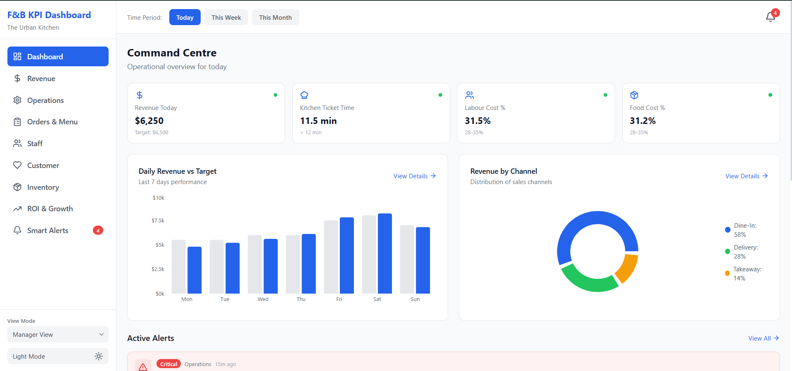
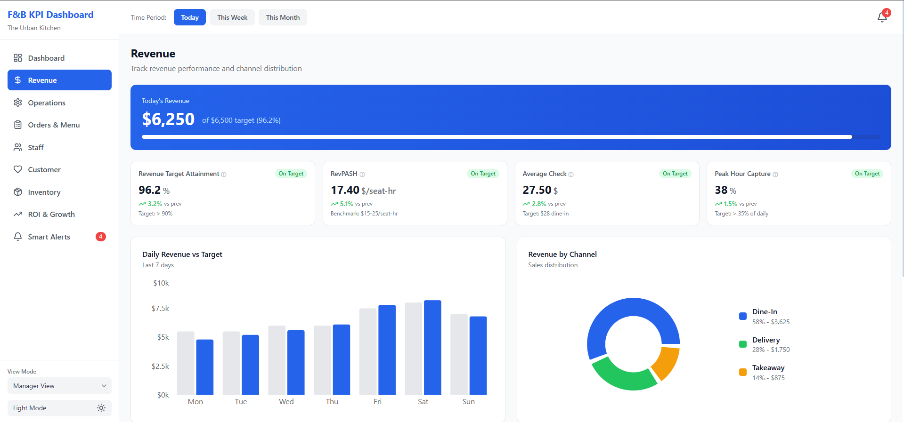
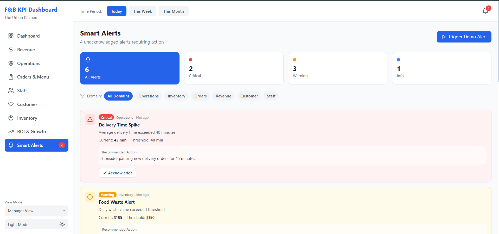

# 📊 FB-KPI-DASHBOARD

A modern, responsive KPI dashboard built with React and Vite, designed to visualize key performance indicators with a clean UI and real-time insights.

---

## 🚀 Live Demo
👉 **Live Link:** https://fb-kpi-dashboard.vercel.app/


## 📸 Screenshots

### 🖥️ Dashboard Overview


### 📈 KPI Revenue View


### 📈 KPI Alerts View


---

## ✨ Features

- 📊 Interactive KPI visualization  
- ⚡ Fast performance with Vite  
- 🎨 Styled using Tailwind CSS  
- 📱 Fully responsive design  
- 🔁 Reusable component architecture  
- 📂 Clean and scalable folder structure  
- 🔌 Custom hooks for logic separation  
- 📉 Data-driven UI rendering  

---

## 🛠️ Tech Stack

- **Frontend:** React (Vite)  
- **Styling:** Tailwind CSS  
- **State Management:** React Hooks  
- **Build Tool:** Vite  
- **Package Manager:** npm / pnpm  

---

## 📁 Folder Structure

```bash
FB-KPI-DASHBOARD/
│
├── components/           # Reusable UI components
├── hooks/                # Custom React hooks
├── lib/                  # Utility functions
├── public/               # Static assets
│
├── src/
│   ├── components/       # App-specific components
│   ├── data/             # Static or mock data
│   ├── pages/            # Page-level components
│   ├── styles/           # Tailwind / global styles
│   ├── App.jsx           # Main App component
│   ├── main.jsx          # Entry point
│   └── index.css         # Global CSS
│
├── .gitignore
├── components.json
├── index.html
├── package.json
├── package-lock.json
├── pnpm-lock.yaml
├── postcss.config.js
├── postcss.config.mjs
├── tailwind.config.js
├── tsconfig.json
├── vite.config.js
└── README.md
```

---

## ⚙️ Installation & Setup

Clone the repository:

```bash
git clone https://github.com/sudhanshuverse/fb-kpi-dashboard.git
cd FB-KPI-DASHBOARD
```

Install dependencies:

```bash
npm install
# or
pnpm install
```

Run the development server:

```bash
npm run dev
```

---

## 📦 Build for Production

```bash
npm run build
```

---

## 🙌 Contributing

Contributions are welcome! Feel free to fork the repo and submit a pull request.

---

## 💡 Author
Made with ❤️ by **Sudhanshu (Lovable Sudhanshu)**